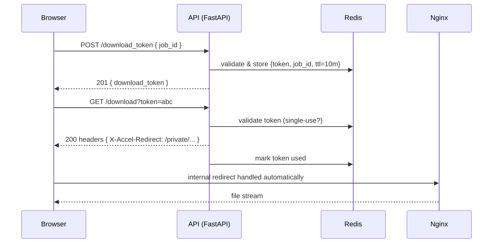

# Download Flow – Front-end Guide

This document explains how TrustyConvert serves converted files and shows the **minimal, secure, and resource-efficient** way to download them from a browser or SPA.

---

## 1. High-level Architecture

```
Browser  ───►  FastAPI  ───►  X-Accel-Redirect header  ───►  Nginx  ───►  /shared/<file>
```

1. **Browser** requests a short-lived *download token*.
2. **FastAPI** validates the request, stores the token in Redis, and returns it.
3. The browser calls `/download?token=…`.
4. FastAPI checks the token and responds with an **empty body** but includes
   `X-Accel-Redirect: /private/<relative_path>`.
5. **Nginx** sees the header and streams the file from disk directly to the
   client – no Python process reads the file.

Advantages:
* Zero-copy streaming, low CPU/RAM usage in the application layer.
* Real file paths never leave the server – only Nginx can access them.
* Tokens are single-use, linked to the user’s session, and expire after
  10 minutes.

---

## 2. Back-end Endpoints

| Method | Path                   | Purpose                     |
| ------ | ---------------------- | --------------------------- |
| POST   | `/download_token`      | Issue a token for a job.    |
| GET    | `/download?token=…`    | Trigger the actual download |

Rate limits: `/download` is limited to **10 requests / minute / IP**.

---

## 3. Request Sequence



---

## 4. Front-end Implementation

### 4.1 Fetch the token

```ts
// example with Axios / Fetch
const {{ data }} = await api.post('/download_token', { job_id });
const token = data.download_token;
```

### 4.2 Start the download – **let the browser stream it**

```ts
// Option 1: simple redirect (opens in current tab)
window.location.href = `/download?token=${token}`;

// Option 2: programmatic click (keeps SPA state intact)
const a = document.createElement('a');
a.href = `/download?token=${token}`;
a.download = '';
document.body.appendChild(a);
a.click();
a.remove();
```

**Do not** fetch the URL with `fetch()` or `axios` and then create a blob – that
would transfer the whole file through JavaScript, wasting memory and blocking
the main thread.

### 4.3 Handling errors

If the token is invalid/expired or the job is not finished, the backend returns
standardised JSON with `error_type` and an appropriate HTTP status. Show a toast
or retry dialog.

---

## 5. Security Notes

* Tokens are **single-use** and bound to the user’s `session_id`. Re-using a
  token returns **403**.
* Tokens expire 10 minutes after creation.
* Nginx hides the real filesystem under `location /private/ { internal; … }`.
* FastAPI sets strict headers:
  * `X-Content-Type-Options: nosniff`
  * `X-Frame-Options: DENY`
  * `X-XSS-Protection: 1; mode=block`
* Rate-limiter prevents brute-force token guessing.

---

## 6. Performance Tips

* Because Nginx streams directly, downloads do **not** tie up FastAPI workers –
  feel free to deliver large files.
* The response includes an `ETag`; browsers will perform conditional GETs if
  re-downloading the same file.
* Enable HTTP/2 or HTTP/3 in your CDN/edge for faster transfers.

---

## 7. Troubleshooting

| Symptom                        | Likely Cause                          |
| ------------------------------ | ------------------------------------- |
| `403 TokenError`               | Token used twice / expired / wrong session |
| `404 ResourceNotFound`         | Job not completed or file cleaned up  |
| Browser downloads an empty file | SPA used `fetch()` instead of regular request |

---

## 8. Quick Checklist

- [x] Wait for job status = `completed`.
- [x] Call `/download_token`.
- [x] Redirect the browser to `/download?token=<token>`.
- [x] Handle potential 4xx/5xx JSON errors.
